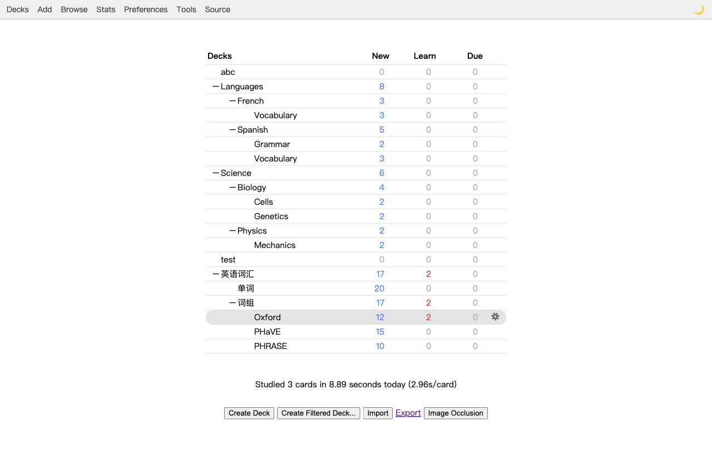
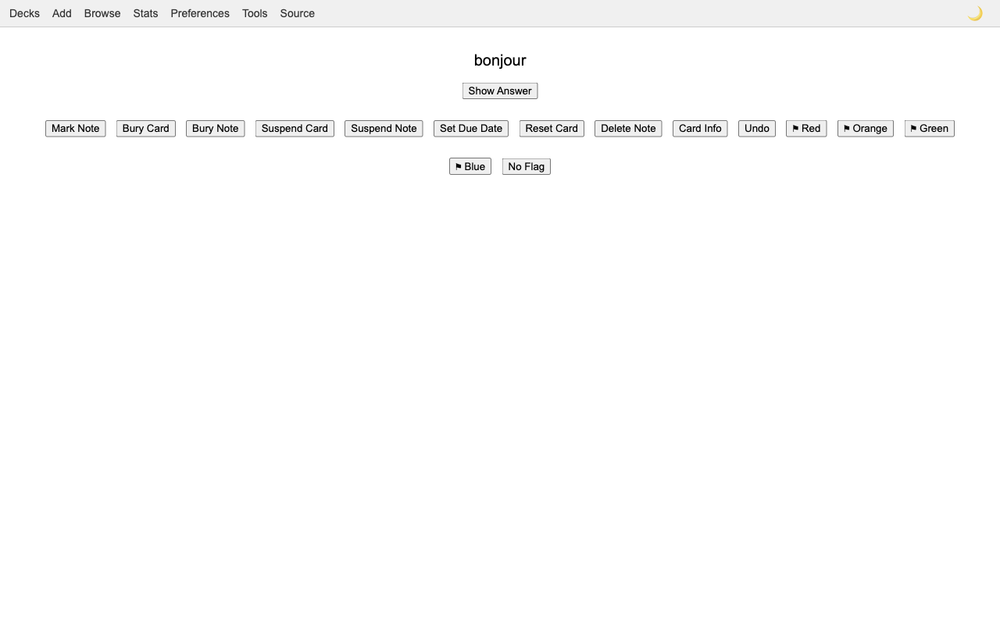
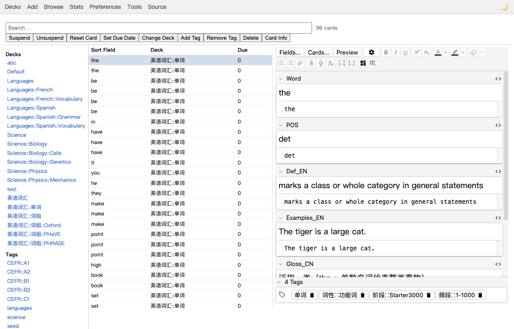
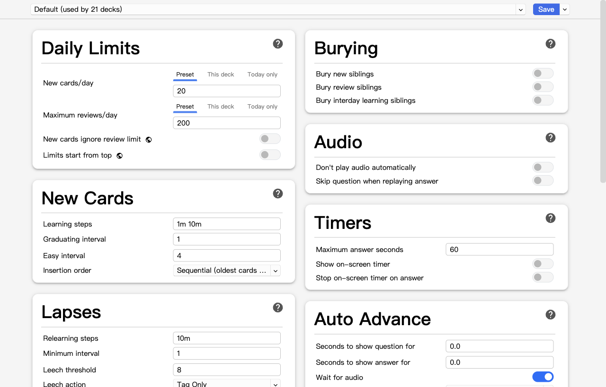
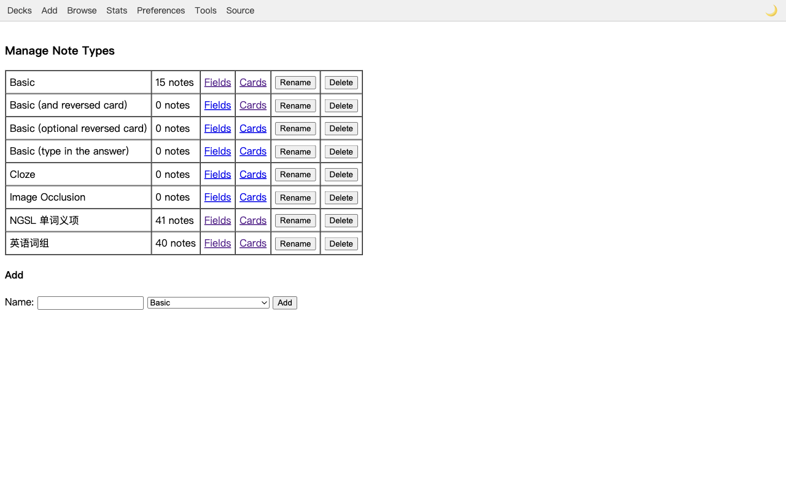

# ankiweb

> ⚠️ **Unofficial, personal, single-user project — not affiliated with Anki/Ankitects.**
> This is an independent, community browser port of [Anki](https://apps.ankiweb.net),
> intended to be run by **one user on their own machine**. It is **NOT** affiliated with,
> endorsed by, or connected to Ankitects Pty Ltd, and it is **NOT** the official **AnkiWeb**
> sync service at apps.ankiweb.net. "Anki" and "AnkiWeb" are names of that upstream
> project/service. This is a hobby/personal implementation provided as-is, with no warranty,
> under AGPL-3.0-or-later (see [LICENSE](LICENSE) and [THIRD-PARTY-NOTICES.md](THIRD-PARTY-NOTICES.md)).

A **browser port of Anki desktop + AnkiConnect**, built on the official `anki` Python
package (pylib) + FastAPI. It serves Anki's real study UI in a browser and re-implements
the full AnkiConnect HTTP API — for a single user, on your own machine.

**It is a faithful translation, not a rewrite.** Where Anki ships a compiled frontend
(the SvelteKit pages for graphs / deck options / change-notetype / imports / image
occlusion, and the `reviewer.js` / `editor.js` bundles), ankiweb **reuses the vendored
build** and bridges it to the `anki` backend; the Qt-only dialogs (overview, custom study,
filtered-deck, export) are rebuilt as small server-rendered pages.

**Scope:** everything in the desktop study/edit/manage flow + the AnkiConnect API.
**Out of scope (by design):** sync (AnkiWeb) and add-ons/plugins.

---

## Screenshots

**Deck browser** — your full deck tree (including nested decks), counts, and the always-present
top toolbar. Anki's home screen, in a browser tab.



**Studying** — the real Anki reviewer (`reviewer.js` + MathJax) drives the card; ankiweb adds a
card-action bar (mark · bury · suspend · set due · reset · delete · undo · flags) and keyboard
shortcuts.



**Browse & edit** — search, a deck/tag sidebar, the results table, and Anki's real `editor.js`
embedded live in the detail pane (with Fields… / Cards… / Preview).



**Reused, not rewritten** — where Anki ships a compiled SvelteKit page, ankiweb serves the
vendored build and wires it to the backend. Here's the full Deck Options screen, unchanged:



**Manage Note Types** — list / add / rename / delete note types, with links into the field and
card-template editors (one of the Tools-menu screens ankiweb rebuilds for the web):



---

## Requirements

- Python **3.12**
- `anki==25.9.4` (pinned — the vendored frontend must match this version; the exact upstream
  Anki/AnkiConnect commits this port was built against are recorded in [UPSTREAM.md](UPSTREAM.md))
- Node.js (only to build the ~2 KB shell bundle)
- A conda env is recommended: installing `anki` pulls a newer `protobuf` that can clash
  with other global packages, so keep it isolated.

## Setup

```bash
conda create -n ankiweb python=3.12 -y
conda run -n ankiweb pip install -e ".[dev]"

# 1. Vendor Anki's compiled frontend (downloads the aqt 25.9.4 wheel, extracts
#    _aqt/data/web/ into ankiweb/web_assets/ — gitignored). Required.
conda run -n ankiweb python tools/fetch_web_assets.py

# 2. Build the shell bridge bundle (shell_src/bootstrap.ts -> ankiweb/shell/static/bootstrap.js)
npm install && npm run build

# 3. (optional) for the Playwright integration tests
conda run -n ankiweb python -m playwright install chromium
```

## Run

```bash
conda run -n ankiweb python -m ankiweb
```

This starts **two servers in one process**:

| Port | Serves | Default | Configure with |
|------|--------|---------|----------------|
| **Web UI + WebSocket** | the browser study/edit UI and the `/ws` bridge (WS shares this port) | `127.0.0.1:8000` | `ANKIWEB_HOST` / `ANKIWEB_PORT` |
| **AnkiConnect HTTP API** | `POST /` JSON API for AnkiConnect clients (+ Swagger docs at [`/docs`](#api-docs-swagger)) | `127.0.0.1:8765` | `ANKIWEB_AC_HOST` / `ANKIWEB_AC_PORT` (or `ankiconnect.json`) |

Open <http://127.0.0.1:8000> in a browser. The AnkiConnect port defaults to **8765** on
purpose — existing AnkiConnect clients/scripts work unchanged.

## Configuration

All settings have safe localhost defaults; override via environment variables:

| Variable | Default | Meaning |
|----------|---------|---------|
| `ANKIWEB_COLLECTION` | `~/.local/share/ankiweb/collection.anki2` | Path to the `.anki2` collection. The parent directory is created automatically; a fresh collection is created if the file doesn't exist. |
| `ANKIWEB_HOST` | `127.0.0.1` | Web UI bind address (`0.0.0.0` to listen on all interfaces). |
| `ANKIWEB_PORT` | `8000` | Web UI port. |
| `ANKIWEB_ALLOWED_HOSTS` | *(empty)* | Comma-separated extra `Host` header values accepted past the DNS-rebinding guard (see **LAN access**). `*` disables the check. |
| `ANKIWEB_AC_HOST` | `127.0.0.1` | AnkiConnect bind address (overrides `ankiconnect.json`). |
| `ANKIWEB_AC_PORT` | `8765` | AnkiConnect port (overrides `ankiconnect.json`). |
| `ANKIWEB_AC_KEY` | *(none)* | AnkiConnect `apiKey` (overrides `ankiconnect.json`). |
| `ANKIWEB_IMPORT_TMP_DIR` | `<collection dir>/import-tmp` | Where uploaded import/image files are staged before the backend reads them. |
| `ANKIWEB_LANG` | *(empty → English)* | UI language, an Anki locale code (e.g. `zh-CN`, `ja`, `de`, `fr`). Chosen at startup — there is no in-app switcher; changing it means changing this var and restarting. See **Language** below. |
| `ANKIWEB_PASSWORD` | *(empty → no password)* | If set, the web UI requires this password (a `/login` page sets a session cookie). Empty = open, the default. The AnkiConnect API keeps its own `ANKIWEB_AC_KEY`. |
| `ANKIWEB_SOURCE_URL` | *(empty)* | AGPL §13 Corresponding-Source location for this deployment, shown on the `/about` page (only relevant if you run it as a public network service). |

**`ankiconnect.json`** (optional) lives next to the collection file and uses AnkiConnect's
own keys; environment variables override it:

```json
{ "webBindAddress": "127.0.0.1", "webBindPort": 8765, "apiKey": null,
  "webCorsOriginList": ["http://localhost"], "ignoreOriginList": [] }
```

### LAN access

To reach the UI from another device, bind to all interfaces **and** allow your host
(the Web UI has a DNS-rebinding guard that only permits localhost by default):

```bash
ANKIWEB_HOST=0.0.0.0 ANKIWEB_ALLOWED_HOSTS=192.168.1.50:8000 \
  conda run -n ankiweb python -m ankiweb
```

`ANKIWEB_ALLOWED_HOSTS` accepts the value with or without a port (`192.168.1.50` matches
any port), multiple comma-separated hosts, or `*` to turn the check off (only on a trusted
network). It covers both HTTP and the WebSocket bridge.

### Language

Set `ANKIWEB_LANG` to any Anki locale code to run the whole UI in that language — both the
reused Anki frontend (graphs / deck options / reviewer / editor …) and ankiweb's own
hand-written screens (deck browser, browser, Add, Preferences, etc.):

```bash
ANKIWEB_LANG=zh-CN conda run -n ankiweb python -m ankiweb
```

The language is fixed at startup (it's applied before the collection is opened); there is
no in-app language switcher, so to change it you set `ANKIWEB_LANG` and restart. Empty or an
unknown code falls back to English. Accepts both `zh-CN` and `zh_CN` forms.

### Password

By default the web UI is open (no login) — it's a single-user, local-first app. To require a
password, set `ANKIWEB_PASSWORD`:

```bash
ANKIWEB_PASSWORD=mysecret conda run -n ankiweb python -m ankiweb
```

Visitors then get a `/login` page; the correct password sets an httponly session cookie and
unlocks the UI (and the `/ws` bridge). `/logout` clears it. This gates the **web app only**;
the AnkiConnect HTTP API (port 8765) is controlled separately by `ANKIWEB_AC_KEY`. It's a
light gate for LAN use, not a hardened auth system — serve over HTTPS if it matters.

### API docs (Swagger)

The AnkiConnect server publishes interactive OpenAPI docs at
<http://127.0.0.1:8765/docs> (schema at `/openapi.json`). Every action has a standard
Pydantic request schema and a documented `POST /actions/<name>` route you can call straight
from the page ("Try it out"), e.g. `POST /actions/findCards` with body
`{"query": "deck:French is:due"}`.

These typed routes are an **additive convenience layer** — the canonical AnkiConnect contract
is unchanged: real clients still `POST /` with `{"action", "version", "params"}`, and the
`/actions/*` routes call the exact same dispatcher, so behavior never diverges. When
`ANKIWEB_AC_KEY` is set, send it as the `X-API-Key` header (use the **Authorize** button in
Swagger); the canonical `POST /` keeps reading the key from the request body as upstream does.

### Night mode

Toggle with the 🌙 button in the top toolbar (persisted in `localStorage`); it themes the
server-rendered pages and threads `#night` into links to the SvelteKit pages so those
render dark too.

### Navigation

Every server-rendered screen has an always-present top toolbar — **Decks · Add · Browse ·
Stats** (Anki's main-window toolbar, minus Sync) plus the night-mode toggle. The SvelteKit
pages (graphs, deck options, change-notetype, imports, image occlusion) are task pages
opened from there; use the browser's back button to return.

## Architecture

- **`anki` pylib** owns the collection, scheduler (v3), and the Rust backend (protobuf).
- **`ankiweb/collection_service.py`** — a single-worker, serialized wrapper around the one
  `Collection` (pylib objects aren't thread-safe). An auxiliary pool runs the thread-safe
  Rust calls that must be concurrent (FSRS compute/simulate + `latest_progress` polling) so
  deck-options shows live optimize progress.
- **`ankiweb/assets.py`** — serves the vendored Anki frontend (`/_anki/...`, `/_app/...`)
  and routes the reused SvelteKit SPA pages.
- **`ankiweb/anki_rpc/`** — `POST /_anki/{method}`: passthrough / custom / concurrent
  dispatch to `col._backend.<method>_raw` (protobuf in, protobuf out).
- **`ankiweb/bridge/`** — the WebSocket `/ws` `pycmd` bridge that the screens use to talk to
  the server (the desktop `pycmd`/`bridgeCommand` shim, in `shell_src/bootstrap.ts`).
- **`ankiweb/screens/`** — server-rendered pages (deck browser, overview, reviewer, browser,
  editor, add, custom study, filtered deck, export) that mount Anki's real `reviewer.js` /
  `editor.js` where applicable.
- **`ankiweb/ankiconnect/`** — the AnkiConnect HTTP API (≈120 actions, minus sync).
- **`ankiweb/__main__.py`** — runs the Web app and the AnkiConnect app as two uvicorn
  servers on a shared collection + bridge hub.

## Test

```bash
conda run -n ankiweb python -m pytest            # full suite (Playwright tests skip if chromium absent)
```

Integration tests use Playwright + real Chromium against a live uvicorn server; install the
browser once with `python -m playwright install chromium`.

## Project layout

```
ankiweb/            the application package (collection_service, assets, anki_rpc, bridge, screens, ankiconnect)
shell_src/          the TS pycmd-bridge shell (compiled to ankiweb/shell/static/bootstrap.js)
tools/              fetch_web_assets.py (vendor the frontend), build_shell.mjs (build the shell)
tests/              pytest suite (backend + bridge + Playwright integration)
docs/superpowers/   design specs + implementation plans
```

## License

ankiweb is licensed under the **GNU Affero General Public License, version 3 or later
(AGPL-3.0-or-later)** — see [LICENSE](LICENSE).

It is a **derivative/combined work**: it links the **Anki** Python library (`anki`,
AGPL-3.0-or-later) at runtime, bundles and serves Anki's compiled frontend, and
re-implements the **AnkiConnect** HTTP API (Copyright 2016–2021 Alex Yatskov,
GPL-3.0-or-later) by closely following its source. Per GPLv3 §13 / AGPLv3 §13 these combine,
and the project as a whole is distributed under AGPL-3.0-or-later. Upstream copyrights and
the permissive sub-licenses of vendored components (MathJax/Apache-2.0, jQuery/MIT,
protobuf.js/BSD-3, etc.) are credited in [THIRD-PARTY-NOTICES.md](THIRD-PARTY-NOTICES.md);
the GPL-3.0 text covering the AnkiConnect-derived code is in
[LICENSES/GPL-3.0-or-later.txt](LICENSES/GPL-3.0-or-later.txt).

### Source code (AGPL §13)

Because ankiweb is a network service, every user interacting with it over a network is
entitled to its Corresponding Source. The running app exposes a **Source** link (the top
toolbar → `/about`). Set **`ANKIWEB_SOURCE_URL`** to where your deployed source lives so that
link points at the exact running version; the pinned Anki/aqt 25.9.4 source is at
<https://github.com/ankitects/anki> and AnkiConnect at <https://github.com/FooSoft/anki-connect>.

Copyright (C) 2026 tsc. Anki © Ankitects Pty Ltd and contributors. AnkiConnect © 2016–2021
Alex Yatskov.

> **Naming note:** "ankiweb" collides with Anki's own **AnkiWeb** sync service and trademark.
> The AGPL covers the code but grants no trademark rights; consider renaming before any public
> release to avoid implying endorsement.
